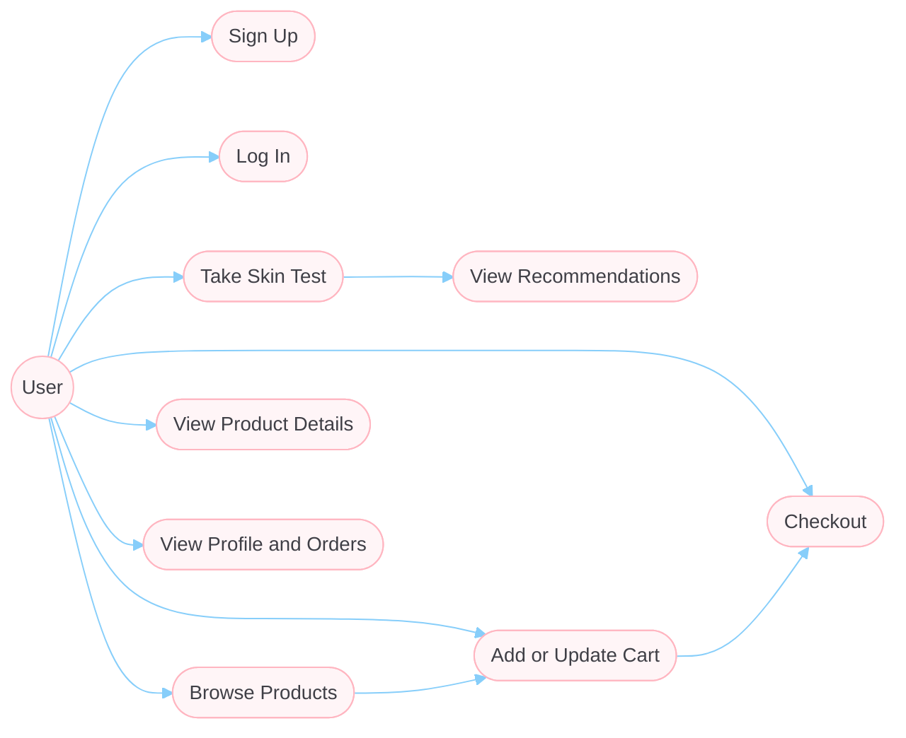
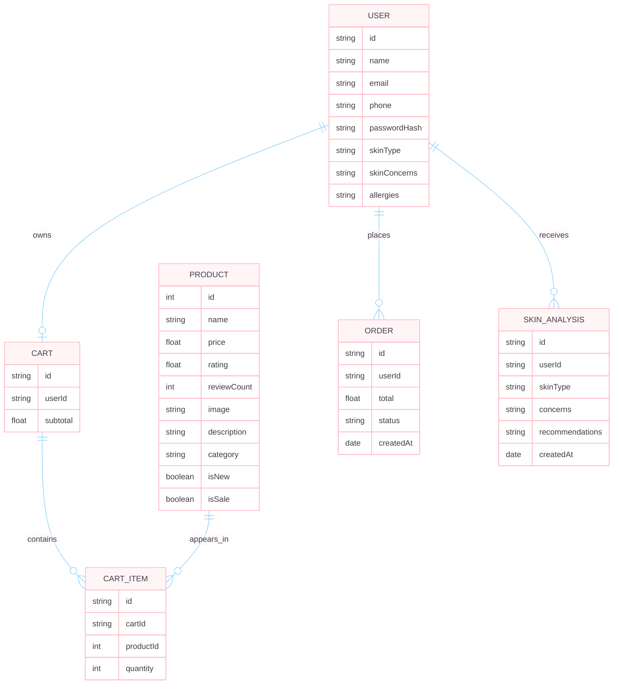
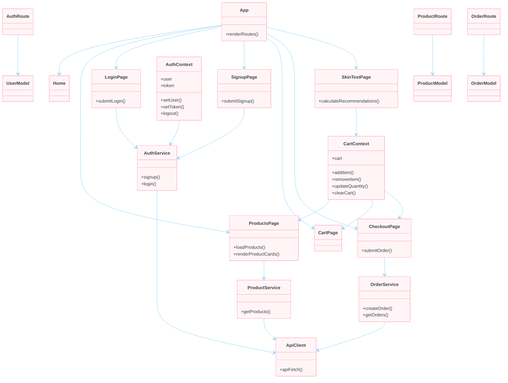
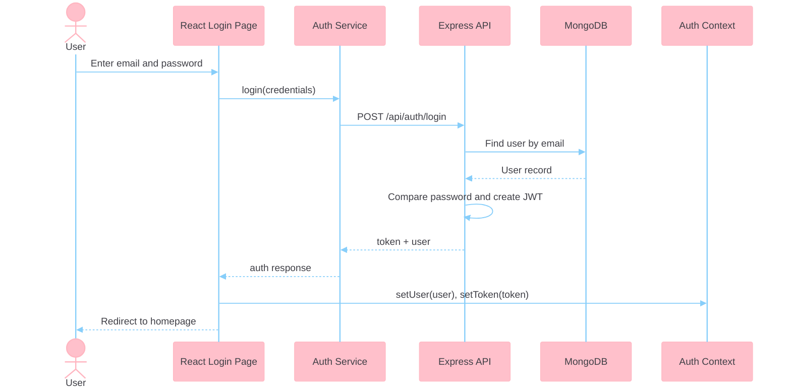

# Noorify

Noorify is a full-stack skincare web application built for a modern e-commerce and personalization workflow. Users can create an account, explore skincare products, take a skin test, get tailored recommendations, manage a cart, and place demo orders through a clean React frontend backed by a Node.js, Express, and MongoDB API.

This project is designed to be portfolio-ready and demonstrates end-to-end product thinking across frontend UI, API integration, authentication, state management, and database-backed user flows.

## Project Overview

Noorify combines a skincare product catalog with basic personalization features:

- users can sign up and log in securely
- products are loaded from the backend API
- users can add products to a cart and proceed through checkout
- profile pages show saved account details and order history
- skin test and skin analysis flows support recommendation-driven UX

## Features

- JWT-based authentication with signup and login
- Product listing page connected to `/api/products`
- Cart management with quantity updates and subtotal calculation
- Demo checkout flow with order creation stored in MongoDB
- Profile page with order history
- Skin test and recommendation-driven experience
- Responsive UI built with Tailwind CSS
- Scroll-to-top behavior on route change
- Fallback handling for broken product images

## Tech Stack

- Frontend: React, Vite, Tailwind CSS, React Router
- Backend: Node.js, Express
- Database: MongoDB, Mongoose
- Authentication: JWT
- Tooling: ESLint, PostCSS

## Installation

### Prerequisites

- Node.js 18+
- npm

Optional local database choices:

- MongoDB running locally, or
- the included in-memory development Mongo runner

### 1. Clone the repository

```bash
git clone https://github.com/aditisoni-17/Skincare_Recommendation_App.git
cd Skincare_Recommendation_App
```

### 2. Install dependencies

```bash
npm install
```

### 3. Configure environment variables

Create a local `.env` file from `.env.example`:

```bash
cp .env.example .env
```

Example values:

```env
MONGODB_URI=mongodb://127.0.0.1:27017/noorify
JWT_SECRET=replace-me
PORT=5174
```

### 4. Start the project

Frontend:

```bash
npm run dev
```

Backend:

```bash
node server/index.js
```

If you want a lightweight local Mongo instance for development:

```bash
npm run dev:db
```

You can also run frontend and backend together:

```bash
npm run dev:full
```

### Local URLs

- Frontend: `http://localhost:5173`
- Backend: `http://localhost:5174`

## Demo Test User

If you want to seed a test account:

```bash
npm run seed:test-user
```

Default credentials:

- Email: `test@noorify.com`
- Password: `123456`

## Screenshots

Add your screenshots to this section before publishing the project.

### Home Page

`[Insert homepage screenshot here]`

### Products Page

`[Insert products screenshot here]`

### Skin Test / Recommendations

`[Insert skin test screenshot here]`

### Cart / Checkout

`[Insert cart or checkout screenshot here]`

### Profile / Orders

`[Insert profile screenshot here]`

## System Design Diagrams

### Use Case Diagram

This diagram shows the main user interactions supported by Noorify, including authentication, recommendation flows, product browsing, cart management, and checkout.



### ER Diagram

This diagram represents the core data model behind Noorify. Some parts, such as cart and skin analysis, may be handled partially in frontend state today, but they are shown here as logical product entities in the system design.



### Class Diagram

This class diagram highlights the main frontend and backend building blocks used in Noorify, including UI pages, shared services, API routes, and persistence models.



### Sequence Diagram

This sequence diagram shows a key Noorify flow: a user logs in from the React frontend, the API validates credentials, MongoDB returns the user record, and the app stores auth state before redirecting.



## Project Structure

```bash
.
├── public/
├── server/
│   ├── lib/
│   ├── middleware/
│   ├── models/
│   ├── routes/
│   ├── scripts/
│   └── services/
├── src/
│   ├── components/
│   ├── contexts/
│   ├── pages/
│   ├── services/
│   └── utils/
├── .env.example
├── package.json
└── README.md
```

## Available Scripts

- `npm run dev` - start the frontend dev server
- `npm run dev:server` - start the Express backend
- `npm run dev:db` - start the in-memory MongoDB dev instance
- `npm run dev:full` - run frontend and backend together
- `npm run build` - create a production frontend build
- `npm run preview` - preview the built frontend
- `npm run seed:test-user` - create or update the local test user

## Future Improvements

- Replace demo checkout with real payment integration
- Add admin product management UI
- Expand recommendation logic with richer user profiling
- Add product search and advanced filtering
- Add testing coverage for frontend and backend flows
- Improve image optimization and asset handling
- Add deployment documentation for frontend and backend separately

## Author

Aditi Soni
